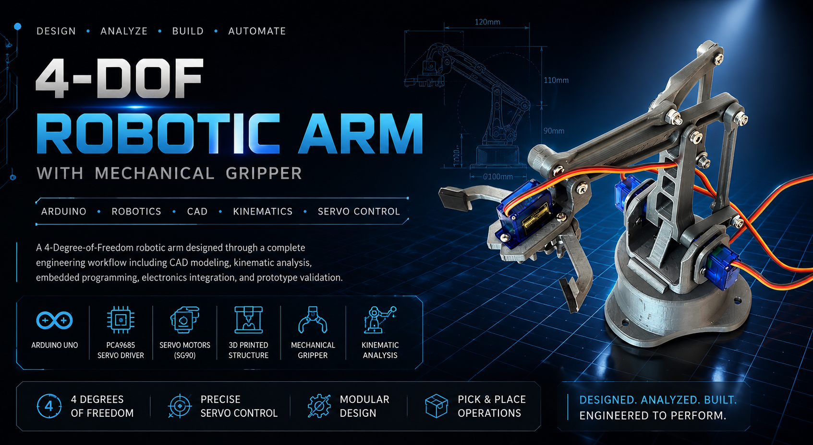
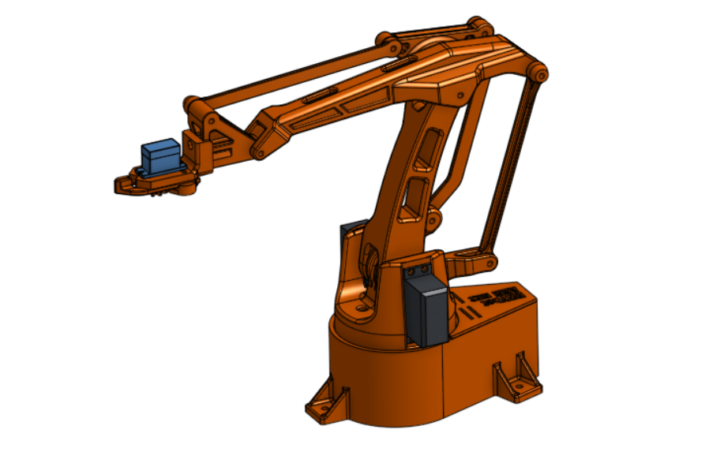
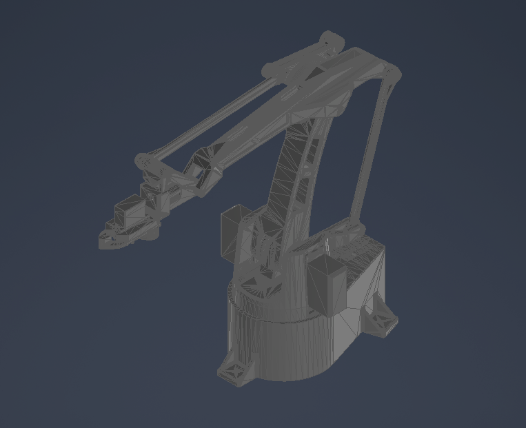
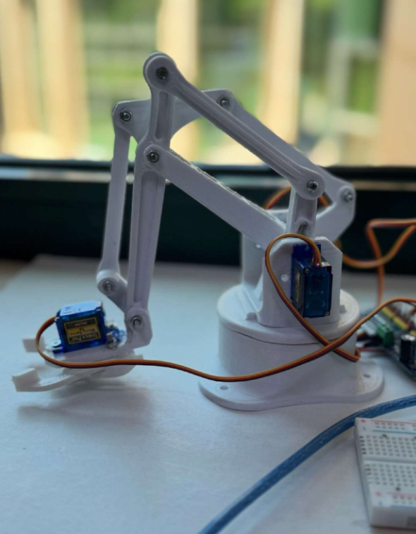
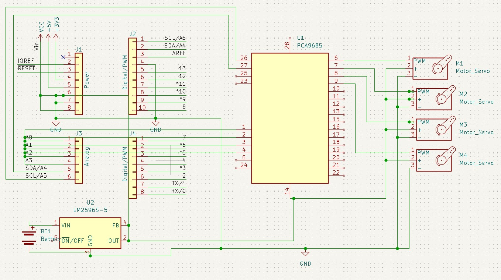
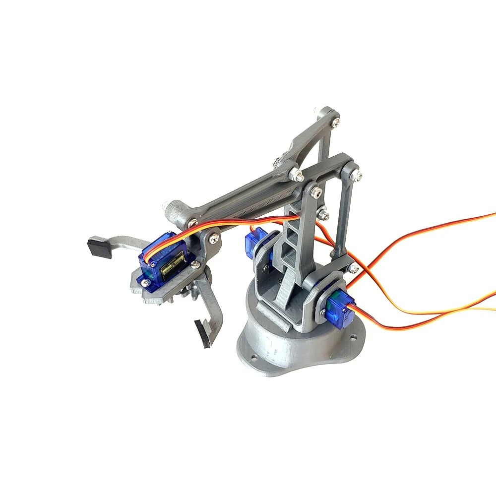

<p align="center">
    
</p>

<h1 align="center">🦾 4-DOF Robotic Arm with Mechanical Gripper</h1>

<p align="center">
A servo-actuated robotic manipulator engineered through a complete workflow involving
mechanical design, CAD modeling, embedded programming, kinematic analysis,
electronics integration, and prototype development.
</p>

<p align="center">


</p>

---

## 📑 Table of Contents

- [Project Overview](#-project-overview)
- [Design Objectives](#-design-objectives)
- [Technical Specifications](#-technical-specifications)
- [System Architecture](#️-system-architecture)
- [Mechanical Design](#️-mechanical-design)
- [Kinematic Analysis](#-kinematic-analysis)
- [Electronics Design](#-electronics-design)
- [Control System](#-control-system)
- [Software Implementation](#-software-implementation)
- [Prototype](#-prototype)
- [Challenges & Engineering Decisions](#-challenges--engineering-decisions)
- [Future Improvements](#-future-improvements)
- [Repository Structure](#-repository-structure)
- [Documentation](#-documentation)
- [Team](#-team)
- [References](#-references)
- [License](#-license)

---

## 📖 Project Overview

### Background

Robotic manipulators are fundamental components in modern automation, enabling precise and repeatable motion in applications ranging from manufacturing and assembly to laboratory automation and education. Designing one requires integrating mechanical engineering, electronics, embedded systems, and motion control into a single coordinated system.

This project presents the development of a **4-Degree-of-Freedom (4-DOF) robotic arm equipped with a servo-driven mechanical gripper**, designed to perform basic pick-and-place operations while demonstrating the principles of robotic manipulation.

Unlike a simple hobby build, the project follows a structured engineering workflow: concept development, CAD modeling, electronics integration, embedded programming, and physical prototype validation.

### Project Goals

The objective was to design and build a compact robotic manipulator capable of controlled object handling while applying fundamental concepts of mechatronics engineering, with focus on:

- Mechanical system design
- CAD modeling and assembly
- Servo motor actuation
- Embedded programming with Arduino
- Robotic kinematics
- Electronics integration
- Motion control
- Prototype development

### Key Features

| | |
|---|---|
| 🦾 Four Degrees of Freedom (4-DOF) | 🤏 Servo-Driven Mechanical Gripper |
| 🎯 Pick-and-Place Functionality | ⚙️ Arduino-Based Motion Control |
| 📐 Fully Designed in Autodesk Inventor | 🔩 Modular Mechanical Assembly |
| 📊 Kinematic Motion Analysis | 🔌 Integrated Electronic System |
| 📦 Compact Educational Robotics Platform | |

---

## 🎯 Design Objectives

- Design a compact robotic manipulator with four rotational joints.
- Develop a reliable mechanical gripper capable of object manipulation.
- Achieve smooth and accurate servo-controlled motion.
- Create a modular CAD assembly for simplified manufacturing and maintenance.
- Integrate embedded hardware and software into a complete mechatronic system.
- Demonstrate the fundamentals of robotic manipulation through prototype testing.

---

## 📋 Technical Specifications

| Feature | Specification |
|----------|--------------|
| Degrees of Freedom | 4 |
| End Effector | Mechanical Gripper |
| Actuation | Servo Motors |
| Controller | Arduino Uno |
| Programming Language | C++ |
| CAD Software | Autodesk Inventor |
| Control Method | Joint Position Control (Open-Loop) |
| Application | Pick-and-Place Operations |

---

## 🏗️ System Architecture

The robotic arm consists of four integrated engineering subsystems working together to perform controlled manipulation tasks.

```text
                 User Input
                      │
                      ▼
              Arduino Controller
                      │
          ┌───────────┴───────────┐
          ▼                       ▼
     Servo Control         Motion Commands
          │
          ▼
      Servo Motors
          │
          ▼
     Robotic Arm Joints
          │
          ▼
 Mechanical Gripper
          │
          ▼
 Object Manipulation
```

| Subsystem | Components |
|---|---|
| **Mechanical** | Base assembly, rotating joints, structural links, mechanical gripper, fastening hardware |
| **Electronics** | Arduino Uno, servo motors, external power supply, wiring harness |
| **Software** | Arduino firmware, servo motion control, position commands, sequential motion logic |

<p align="center">

</p>

> **Figure 1.** CAD model of the complete 4-DOF robotic arm assembly designed in Autodesk Inventor.

> **Engineering Focus**
>
> This project demonstrates how mechanical design, embedded systems, electronics, and robotics can be integrated into a complete mechatronic system. The emphasis is not only on achieving functional motion, but on understanding the engineering principles behind manipulator design, system integration, and controlled robotic movement.

---

## ⚙️ Mechanical Design

### Design Philosophy

The robotic arm was designed to be compact, lightweight, and modular — capable of performing basic pick-and-place operations while demonstrating the principles of robotic motion and mechatronic system integration.

Throughout the design process, emphasis was placed on balancing structural rigidity, ease of assembly, and smooth joint movement. Every component was modeled in **Autodesk Inventor** before manufacturing to verify dimensions, clearances, and overall system compatibility.

### Overall Structure

The manipulator consists of four rotational joints connected through rigid structural links, providing four degrees of freedom for positioning the end effector within its workspace. The complete mechanical assembly includes:

- Base assembly
- Shoulder joint
- Elbow joint
- Wrist joint
- Mechanical gripper
- Structural links
- Fasteners and servo mounts

<p align="center">

</p>

> **Figure 2.** CAD model of the robotic arm assembly.

### Modular Design

A modular approach was adopted throughout to simplify manufacturing, maintenance, and future upgrades. Each link and joint can be removed or replaced independently without requiring a complete redesign of the manipulator, which enables:

- Easier maintenance
- Simplified assembly
- Reduced manufacturing complexity
- Future component upgrades

### End Effector

The robotic arm uses a servo-actuated mechanical gripper as its end effector, converting the rotational motion of a servo motor into the opening and closing movement required to grasp objects securely. The design allows the arm to manipulate lightweight objects while maintaining a compact overall structure.

### Design Highlights

- Compact desktop-sized manipulator
- Lightweight structural design
- Modular mechanical assembly
- Servo-integrated joints
- Replaceable mechanical components
- CAD-first engineering workflow

---

## 📐 Kinematic Analysis

### Degrees of Freedom

The robotic arm provides **four degrees of freedom (4-DOF)** through four independently actuated revolute joints, each contributing to the overall positioning of the end effector within the robot's workspace:

- Base rotation
- Shoulder rotation
- Elbow rotation
- Wrist rotation

Together, these joints allow the robotic arm to reach the positions and orientations needed for basic manipulation tasks.

### Joint Configuration

<p align="center">

</p>

> **Figure 3.** Joint arrangement of the robotic arm.

### Workspace

The manipulator was designed to maximize usable workspace while maintaining a compact footprint. The arrangement of the arm links enables:

- Horizontal positioning
- Vertical positioning
- Object pickup and placement
- Controlled reach within the operating envelope

Although the robot is intended primarily as an educational platform, the same kinematic principles apply to industrial robotic manipulators.

### Motion Control

Each servo motor controls one revolute joint independently. Coordinated movement of all four joints allows the end effector to follow smooth motion paths between target positions. Joint angles are generated by the Arduino controller and transmitted directly to the corresponding servo motors.

---

## 🔌 Electronics Design

The robotic arm is controlled by an Arduino-based embedded system responsible for coordinating the motion of all servo motors. The electrical system was designed with simplicity, reliability, and ease of implementation in mind.

### Hardware Components

- Arduino Uno
- Servo motors (joints)
- Mechanical gripper servo
- External power supply
- Wiring harness

### Wiring Diagram

<p align="center">

</p>

> **Figure 4.** Electrical wiring of the robotic arm.

### Electronic Architecture

```text
Power Supply
      │
      ▼
 Arduino Uno
      │
      ▼
 Servo Signals
      │
 ┌────┼────┬────┐
 ▼    ▼    ▼    ▼
J1   J2   J3   J4
                │
                ▼
      Mechanical Gripper
```

### Design Considerations

The electronics layout was organized to:

- Minimize wiring complexity
- Ensure reliable servo operation
- Simplify troubleshooting
- Support modular assembly
- Allow future hardware expansion

---

## 🧠 Control System

The robotic arm employs an **open-loop joint position control** strategy using standard hobby servo motors. Each servo receives a target angle generated by the Arduino microcontroller, allowing coordinated movement of the robotic arm through sequential joint positioning.

### Control Workflow

```text
User Command
      │
      ▼
Arduino Controller
      │
      ▼
Joint Angle Calculation
      │
      ▼
Servo Position Commands
      │
      ▼
Joint Rotation
      │
      ▼
End Effector Motion
```

### Motion Sequence

The embedded software coordinates the motion of all four joints to execute pick-and-place operations:

1. Move to pickup position.
2. Open gripper.
3. Lower end effector.
4. Close gripper.
5. Lift object.
6. Move to destination.
7. Release object.
8. Return to home position.

---

## 💻 Software Implementation

The control software was developed using the **Arduino IDE** in **C++**. The firmware generates servo control signals and coordinates the movement of each joint.

### Software Features

- Servo position control
- Sequential motion execution
- Joint synchronization
- Pick-and-place operation
- Expandable program structure

### Software Architecture

```text
Initialize Arduino
      │
      ▼
Initialize Servos
      │
      ▼
Receive Motion Command
      │
      ▼
Calculate Joint Angles
      │
      ▼
Move Servos
      │
      ▼
Operate Gripper
      │
      ▼
Repeat
```

The modular structure allows additional features — such as inverse kinematics, joystick control, or wireless communication — to be incorporated with minimal changes to the existing codebase.

---

## 🤖 Prototype

<p align="center">

</p>

> **Figure 5.** Assembled physical prototype of the 4-DOF robotic arm.

The physical prototype validates the CAD design and control system, demonstrating reliable joint actuation and successful execution of pick-and-place sequences within the designed workspace.

---

## 🚧 Challenges & Engineering Decisions

Developing the robotic arm required balancing mechanical simplicity, reliable operation, and limited hardware resources. Several engineering challenges shaped the final design.

### Mechanical Challenges

**Structural stability** — The arm needed to remain rigid while supporting the weight of the links, servo motors, and payload. To improve stability:
- Structural components were designed to minimize unnecessary weight.
- Servo mounts were reinforced to reduce flex during movement.
- The base was designed to provide a stable foundation for the entire manipulator.

**Range of motion** — Each joint was positioned to maximize the robot's reachable workspace while avoiding mechanical interference between adjacent links. Joint placement and link lengths were optimized to provide smooth motion and practical reach for pick-and-place operations.

### Electronics Challenges

Servo motors require stable power delivery, particularly when multiple joints move simultaneously. To improve system reliability:
- Wiring was organized to reduce clutter.
- Signal and power connections were kept as short as practical.
- Components were positioned to simplify maintenance and troubleshooting.

### Software Challenges

Synchronizing multiple servo motors required careful sequencing to produce smooth, repeatable movement. The software was designed with a modular structure, making it easier to modify motion sequences and expand the system in future iterations.

### Engineering Decisions

| Decision | Rationale |
|---|---|
| Arduino Uno | Simplicity and extensive community support |
| Servo motors | Accurate position control, easy integration |
| Autodesk Inventor | Validate mechanical design before fabrication |
| Modular construction | Simplify assembly and maintenance |
| Open-loop position control | Reliable foundation for future enhancements |

---

## 🚀 Future Improvements

### Mechanical
- Aluminum or carbon-fiber structural components
- Improved gripper mechanism
- Increased payload capacity
- Larger operating workspace
- Higher precision bearings

### Electronics
- Custom PCB for cleaner wiring
- External regulated power supply
- Servo current monitoring
- Integrated emergency stop circuit

### Software
- Inverse kinematics implementation
- Trajectory planning
- Smooth acceleration and deceleration
- Motion recording and playback
- Joystick or wireless control

### Robotics & Automation

Future versions could incorporate more advanced concepts, including:
- ROS 2 integration
- Computer vision for object recognition
- Automatic object sorting
- Machine learning for grasp optimization
- Autonomous pick-and-place routines
- Closed-loop feedback using encoders

These additions would transform the platform from an educational manipulator into a more capable research and automation system.

---

## 📁 Repository Structure

```text
4-dof-robotic-arm
│
├── cad
│   └── cad-arm.stl
│
├── docs
│   └── Arduino-Based-Robotic-Arm-with-Mechanical-Gripper-Report.pdf
│
├── electronics
│   └── wiring.jpeg
│
├── firmware
│   ├── code-arm.ino
│   └── code.txt
│
├── images
│   ├── hero-banner.png
│   ├── cad-arm.png
│   ├── colored-cad-arm.png
│   ├── RoboticArmPic.jpg
│   ├── Screenshot_2026-06-27_000514.png
│   └── wiring.jpeg
│
├── .gitignore
├── LICENSE
└── README.md
```

---

## 📄 Documentation

A detailed engineering report describing the design methodology, mechanical development, electronics integration, software implementation, and project outcomes is included in the repository:

docs/Arduino-Based-Robotic-Arm-with-Mechanical-Gripper-Report.pdf


The report covers:

- Project objectives
- Mechanical design process
- CAD development
- Electronics design
- Arduino implementation
- Assembly procedure
- Experimental results
- Conclusions

---


## 📚 References

- Arduino Documentation
- Autodesk Inventor Documentation
- Servo Motor Technical Documentation
- Robotics and Mechatronics course materials
- Embedded Systems references

---

## 📄 License

This project is licensed under the **MIT License**. See the [LICENSE](LICENSE) file for more information.

---

## ⭐ Support

If you found this project interesting or helpful:

- ⭐ Star this repository
- 🍴 Fork the project
- 💡 Share your feedback
- 🤝 Connect on LinkedIn

---

<p align="center">

### 🦾 Designed & Built by Mohamed Samer

**Mechatronics Engineering Student**

*Robotics • Embedded Systems • CAD Design • Automation*

</p>
